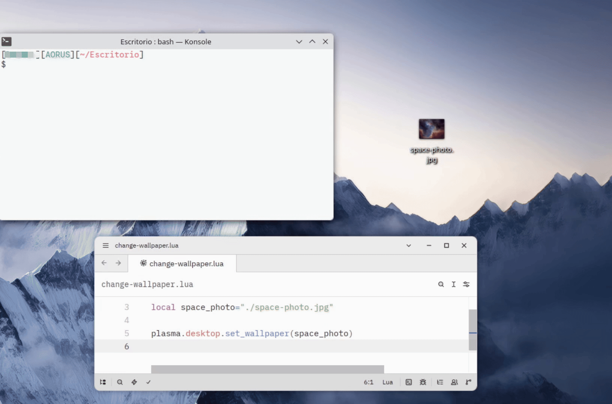

# Lunar Plasma

<br clear="left"/>


## Overview

Lunar Plasma lets you control your [KDE Plasma](https://kde.org/plasma-desktop/) desktop through a [Lua](https://www.lua.org/about.html) interface. Its goal is to make it easy to write scripts that inspect and modify your desktop on demand. Inspired by the scriptable, tinkerer-friendly spirit of projects such as [AwesomeWM](https://awesomewm.org/) and [Hyprland](https://hypr.land/).

Beyond desktop customization, Lunar Plasma also lets you interact with other system properties, such as adjusting the volume or changing screen brightness, all from the same simple Lua interface. It also gives you functions to read system state, like battery level, connected monitors, Wi-Fi status, etc, so you can detect events and react to them in your scripts. Don't dig through Plasma's APIs to hack together a fragile, untested script, write it once and let Lunar Plasma do the work.

> [!IMPORTANT]
> **Early development software.** Lunar Plasma hasn't been battle-tested yet. Expect breaking changes between versions.



## API Reference

See the complete [Lunar Plasma documentation](DOCUMENTATION.md).

## Quick examples

Once Lunar Plasma is installed, you can use it from any script or executable that loads `~/.local/opt/lunar-plasma/lunar-plasma.lua`

#### Set default output volume to 50%

```lua
local plasma = dofile(os.getenv("HOME").."/.local/opt/lunar-plasma/lunar-plasma.lua")

plasma.sound.set(50)
```

#### Send a desktop notification

```lua
local plasma = dofile(os.getenv("HOME").."/.local/opt/lunar-plasma/lunar-plasma.lua")

plasma.notification.send({
    title = "Lunar Plasma",
    text = "Notifications are working",
    icon = "dialog-information",
    sound = "message",
    timeout = 5000,
    type = "info",
})
```

#### Set the Saving power profile

```lua
local plasma = dofile(os.getenv("HOME").."/.local/opt/lunar-plasma/lunar-plasma.lua")

plasma.power.set_profile("saving")
```

#### Set brightness to 70% while charging above 50% and set the performance power profile

```lua
local plasma = dofile(os.getenv("HOME").."/.local/opt/lunar-plasma/lunar-plasma.lua")

if plasma.power.is_battery_charging() then
    local percentage = plasma.power.get_battery_percentage()

    if percentage > 50 then
        plasma.power.set_brightness("HDMI-A-1", 70)
        plasma.power.set_profile("performance")
    end
end
```

#### Set an image as wallpaper on a specific display
**[The background change on a specific screen in this format is not available until the next release]**

```lua
local plasma = dofile(os.getenv("HOME").."/.local/opt/lunar-plasma/lunar-plasma.lua")

local wallpaper = "/path/to/wallpaper.png"
local display = "DVI-D-1"

plasma.desktop.set_wallpaper(wallpaper, display)
```

You can run similar examples from the project root or from inside the `examples` directory without installing Lunar Plasma first.

## Some Features

- Control the volume and mute state of the default audio output.
- Send desktop notifications with custom text, icons, sounds, urgency, and timeout.
- Read battery and power-source state, select power profiles, and request suspend, shutdown, or reboot actions.
- Read and adjust display brightness.
- Inspect connected displays, their current configuration, and available modes.
- List, inspect, and switch configured keyboard layouts.
- Read and change wallpapers across all displays or on a specific display.
- Inspect and control Wi-Fi state and read the active network.
- Inspect and control Bluetooth state and list known or connected devices.
- Use a single Lua entry point backed by D-Bus and system tools.

## Current Goals

You can check our current goals in the [ROADMAP](ROADMAP.md).

The main current goals are:

- Implement an interpreter for running one-shot commands.
- Document integration with other languages such as C, C++, Python, and Rust.
- Implement user modules.
- Expand the available API.

## Dependencies

A standard KDE Plasma desktop should already include most of the tools Lunar Plasma uses. Lua and Bash run the library, while tools such as `pactl`, `notify-send`, `qdbus`, `kscreen-doctor`, `setxkbmap`, `nmcli`, `bluetoothctl`, and `busctl` provide specific features or fallbacks. NetworkManager supplies Wi-Fi state, BlueZ supplies Bluetooth state, and UPower supplies battery information. Lunar Plasma detects the available `qdbus` command automatically.

> [!important]
> It's normal for the package manager to talk about "replacing packages." In this case you can test the program with the regular test suite [`lua tests/test_all.lua`] and everything will probably work fine without the need to install anything! To test the available features against your actual system, use [`LUNAR_TEST_ON_SYSTEM=1 lua tests/test_all.lua`]. **System tests temporarily modify settings such as volume, keyboard layout, brightness, and wallpaper, so use this mode with caution.** You can also install and use only what you need. For example, **if you don't have bluetooth on your computer, you don't need to install bluez for this library to work for your use case**.

If a command is missing, these packages provide the usual dependencies for each distribution family:

### Arch Linux / Manjaro / EndeavourOS / Arch-based distributions

```bash
sudo pacman -S --needed lua bash libpulse libnotify qt6-tools libkscreen xorg-setxkbmap power-profiles-daemon networkmanager bluez-utils upower
```

### Fedora / Nobara / Ultramarine / Fedora-based distributions

```bash
sudo dnf install lua bash pulseaudio-utils libnotify qt6-qttools libkscreen xorg-x11-xkb-utils power-profiles-daemon NetworkManager bluez upower
```

### Debian / Kubuntu / KDE neon / Debian-based distributions

```bash
sudo apt install lua5.4 bash pulseaudio-utils libnotify-bin qdbus-qt6 libkscreen-bin x11-xkb-utils power-profiles-daemon network-manager bluez upower
```

### NixOS

Add the tools to your NixOS configuration. Bash and the D-Bus services normally come with the system and Plasma environment.

```nix
environment.systemPackages = with pkgs; [
  lua54
  pulseaudio
  libnotify
  kdePackages.qttools
  kdePackages.libkscreen
  xorg.setxkbmap
  networkmanager
  bluez
  upower
];

services.power-profiles-daemon.enable = true;
```


## Installation

There are two ways to obtain a tested release of Lunar Plasma: clone the release branch or download a release archive. You can also clone the main branch to contribute or try the latest development features.

### From the release branch

Clone the repository's **release** branch to obtain the current tested release, then run the installer from the project directory:

```bash
git clone --branch release https://github.com/Vaithre/lunar-plasma.git
cd lunar-plasma

chmod +x install.sh
./install.sh
```

### From a release archive

Download a version from the [GitHub releases](https://github.com/Vaithre/lunar-plasma/releases) page, extract it, and run the installer. This is the archive form of the same release available from the release branch.

```bash
tar -xzf "lunar-plasma-[VERSION].tar.gz"
cd "lunar-plasma-[VERSION]"

chmod +x install.sh
./install.sh
```

### From the main branch

Clone **main** if you want to contribute to Lunar Plasma or try the latest development features:

```bash
git clone https://github.com/Vaithre/lunar-plasma.git
cd lunar-plasma

chmod +x install.sh
./install.sh
```

### Installation modes

When `install.sh` starts, choose one of the following modes:

- **Quick installation** installs the runtime only.
- **Custom installation** asks separately whether to install the docs, tests, and examples.

### Installation directory

Lunar Plasma will be installed in `~/.local/opt/lunar-plasma`

To remove the installation:

```bash
chmod +x uninstall.sh
./uninstall.sh
```

## Tested distributions

| Distribution | Status |
|---|---|
| Fedora 44 | Successfully tested |
| Arch Linux | Successfully tested |
| Kubuntu | Successfully tested |

## Known limitations

- The public API may change before the first stable release.
- Wallpaper and brightness support depend on the D-Bus interfaces and plugins available in the current Plasma session.
- Display inspection and keyboard fallbacks depend on optional system tools.
- Wi-Fi, Bluetooth, and battery information depend on NetworkManager, BlueZ, and UPower respectively.

## Contributing

This project uses a variant of [gitlab flow](https://about.gitlab.com/topics/version-control/what-is-gitlab-flow/), where development is done directly on **main** and accepted changes are merged into the **release** branch. You can create pull requests for **main** at any time with any changes, improvements, or bug fixes you would like to suggest. If the contribution makes sense, it will be merged into **main** and will eventually make its way into **release**.

There are no rules regarding commit naming. Contributions that add new features related to the roadmap are especially appreciated. 

The regular test suite uses deterministic fixture backends to verify the functions without depending on the software or hardware available on the current system:

```bash
lua tests/test_all.lua
```

To find out which features actually work on the current system, run every test against the real system backends:

```bash
LUNAR_TEST_ON_SYSTEM=1 lua tests/test_all.lua
```

> [!CAUTION]
> System tests may temporarily change the volume, mute state, keyboard layout, brightness, and wallpaper. Reversible changes are restored after each test. Operations that could suspend, shut down, reboot, interrupt the network, or disconnect Bluetooth devices are reported as skipped.

Hardware-dependent tests are reported as skipped when the required device is not available. If a component fails, the final output lists that component and every failed subtest with its error.

## AI Use

Contributions may use AI, subject to the following conditions:

- Please read, review, and modify the code wherever necessary. You are responsible for the code regardless of how it was created.
- Do not attribute the contribution to Claude or similar tools. This is essentially an advertising method. The same applies to the contents of the code itself.
- Try to write commit messages yourself. LLM-style wording is quite annoying.

Despite this, AI use is not prohibited, far from it. The prototype for this project was accelerated considerably through tools such as Codex. That does not mean I am unfamiliar with the code structure or blindly accept AI output. I constantly change AI generated details and test the program's effects on real hardware. You should do the same!

## License

Lunar Plasma is licensed under the [GNU Lesser General Public License v3.0](LICENSE.md).
